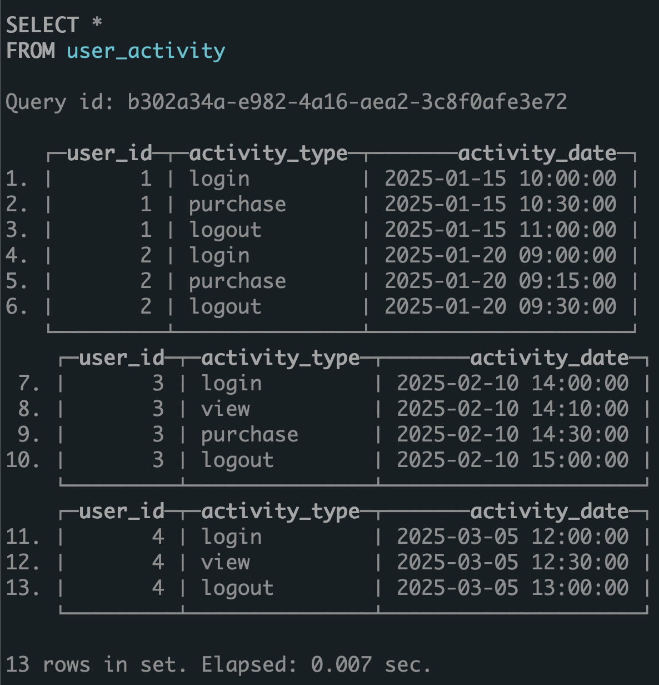
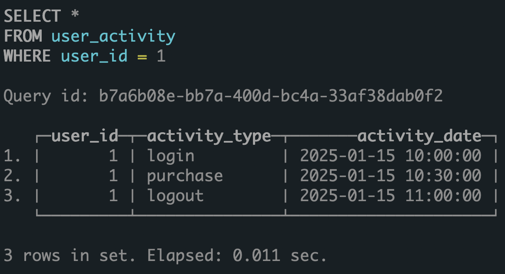
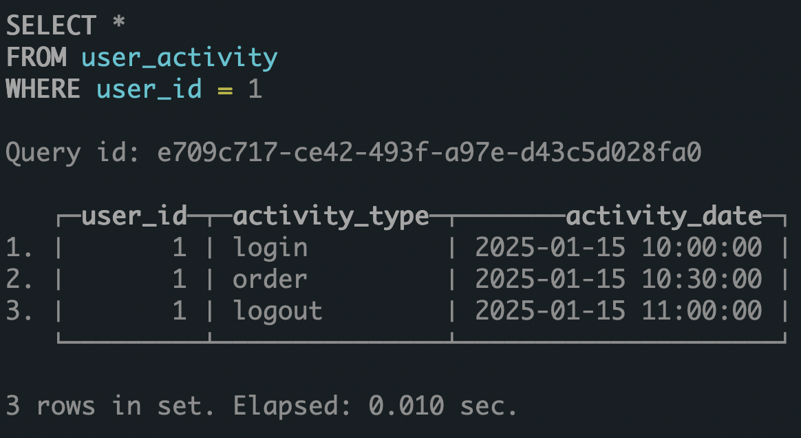
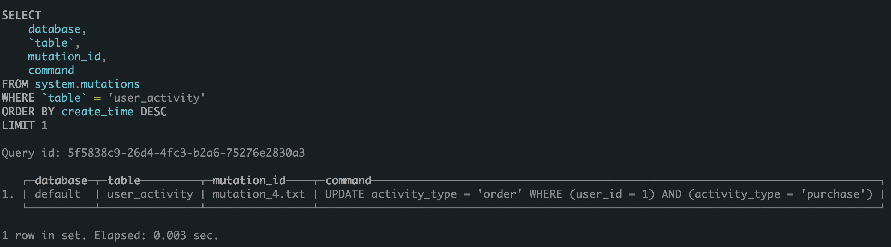
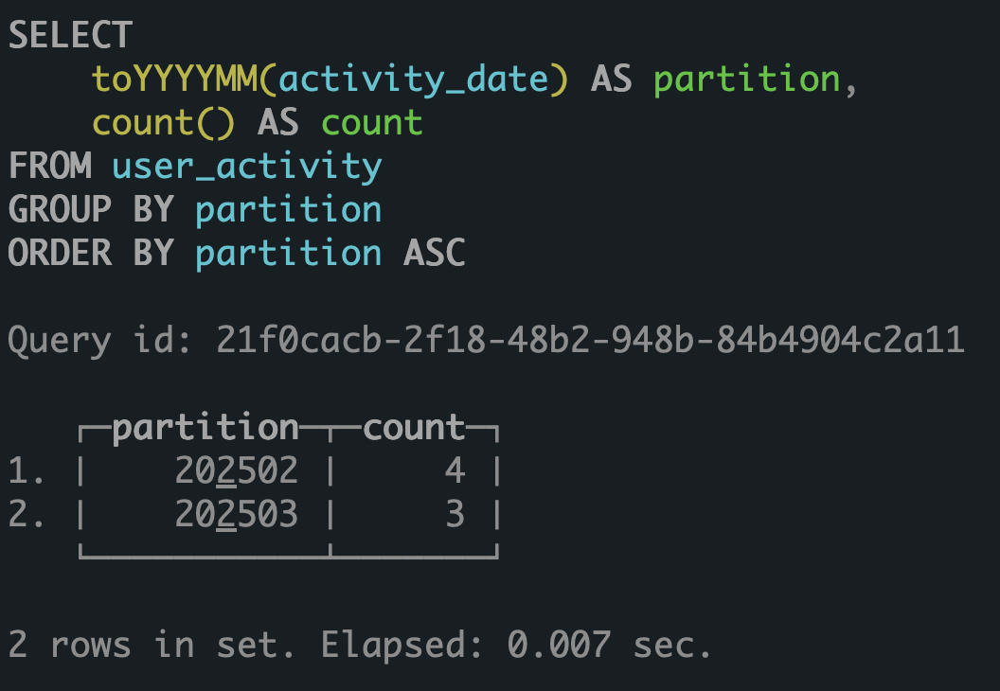
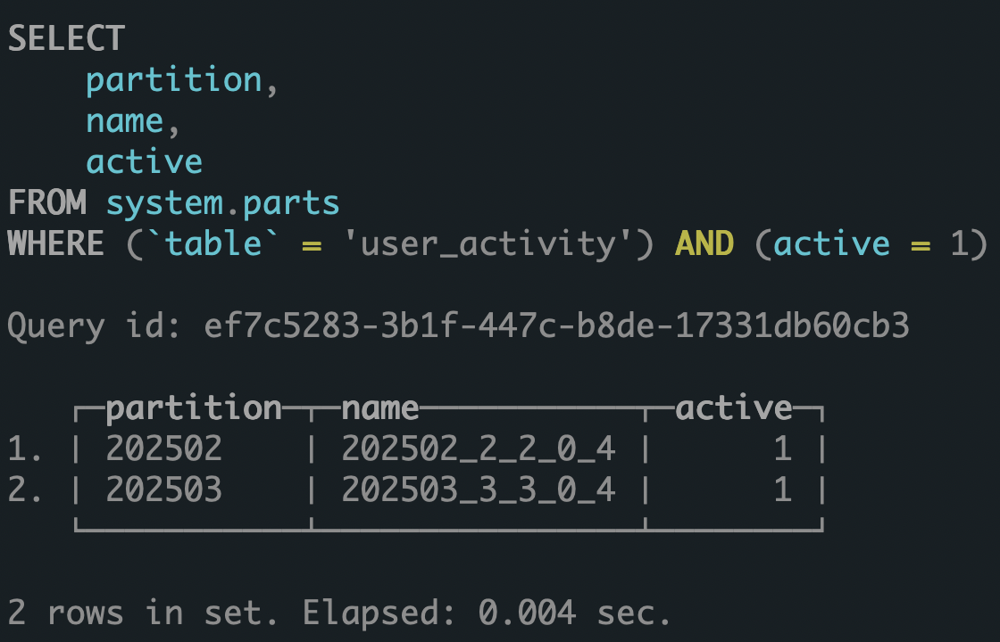
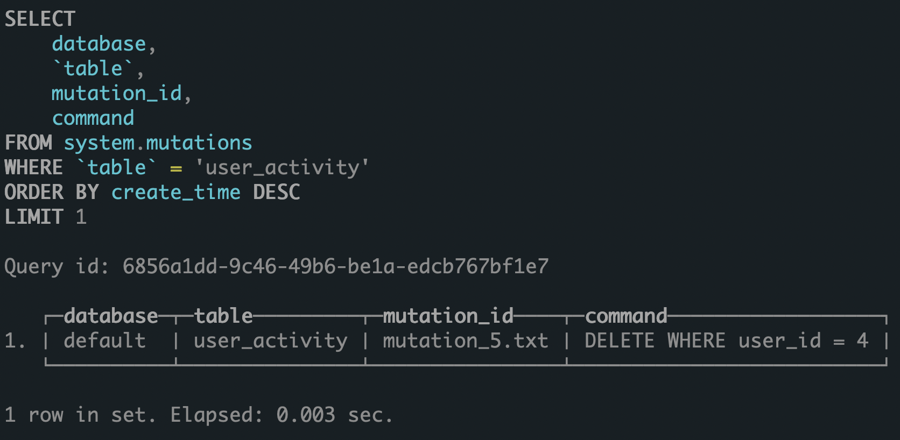
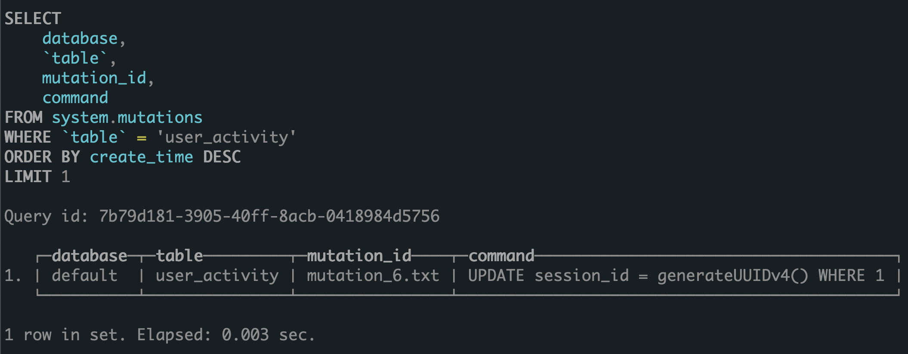
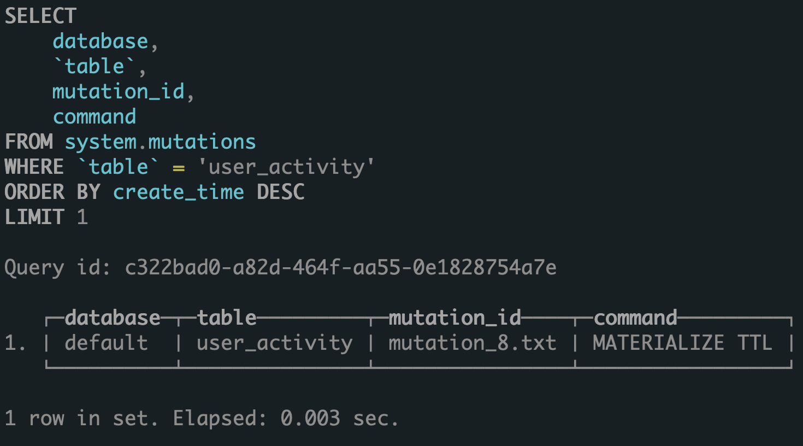

# Домашнее задание: Мутации данных и манипуляции с партициями в ClickHouse

## Выполнение задания

### Шаг 1: Создание таблицы

```sql
CREATE TABLE user_activity (
    user_id UInt32,
    activity_type String,
    activity_date DateTime
) ENGINE = MergeTree()
PARTITION BY toYYYYMM(activity_date)
ORDER BY (user_id, activity_date);
```

### Шаг 2: Заполнение таблицы данными

```sql
INSERT INTO user_activity (user_id, activity_type, activity_date) VALUES
    (1, 'login', '2025-01-15 10:00:00'),
    (1, 'purchase', '2025-01-15 10:30:00'),
    (1, 'logout', '2025-01-15 11:00:00'),
    (2, 'login', '2025-01-20 09:00:00'),
    (2, 'purchase', '2025-01-20 09:15:00'),
    (2, 'logout', '2025-01-20 09:30:00'),
    (3, 'login', '2025-02-10 14:00:00'),
    (3, 'view', '2025-02-10 14:10:00'),
    (3, 'purchase', '2025-02-10 14:30:00'),
    (3, 'logout', '2025-02-10 15:00:00'),
    (4, 'login', '2025-03-05 12:00:00'),
    (4, 'view', '2025-03-05 12:30:00'),
    (4, 'logout', '2025-03-05 13:00:00');
```




### Шаг 3: Выполнение мутации

```sql
-- Изменим тип активности 'purchase' на 'order' для пользователя с user_id = 1
ALTER TABLE user_activity 
    UPDATE activity_type = 'order' 
    WHERE user_id = 1 AND activity_type = 'purchase';
```

### Шаг 4: Проверка результатов

```sql
-- Проверим результаты мутации
SELECT * FROM user_activity WHERE user_id = 1;
```



```sql
-- Проверим статус мутации
SELECT * FROM system.mutations WHERE table = 'user_activity' ORDER BY create_time DESC LIMIT 1;
```



### Шаг 5: Манипуляции с партициями

```sql
-- Удалим партицию за январь 2025
ALTER TABLE user_activity DROP PARTITION '202501';
```

### Шаг 6: Проверка состояния таблицы

```sql
-- Проверим, что данные за январь 2025 были удалены
SELECT
    toYYYYMM(activity_date) AS partition,
    count() AS count
FROM user_activity
GROUP BY partition
ORDER BY partition;
```


```sql
-- Проверим текущие партиции таблицы
SELECT
    partition,
    name,
    active
FROM system.parts
WHERE table = 'user_activity' AND active = 1;
```


## Дополнительные задания

### Другие типы мутаций

```sql
-- Удаление данных с помощью мутации
ALTER TABLE user_activity DELETE WHERE user_id = 4;
```


```sql
-- Добавление нового столбца
ALTER TABLE user_activity ADD COLUMN session_id String DEFAULT generateUUIDv4();
-- Заполнение нового столбца
ALTER TABLE user_activity UPDATE session_id = generateUUIDv4() WHERE 1;
```



### Создание новой партиции и вставка данных

```sql
-- Вставка данных в новую партицию (апрель 2025)
INSERT INTO user_activity (user_id, activity_type, activity_date) VALUES
    (5, 'login', '2025-04-01 08:00:00'),
    (5, 'purchase', '2025-04-01 08:30:00'),
    (5, 'logout', '2025-04-01 09:00:00');
```

### Использование TTL для автоматического удаления старых партиций

```sql
-- Добавление TTL для автоматического удаления данных старше 3 месяцев
ALTER TABLE user_activity MODIFY TTL activity_date + INTERVAL 3 MONTH;
```

